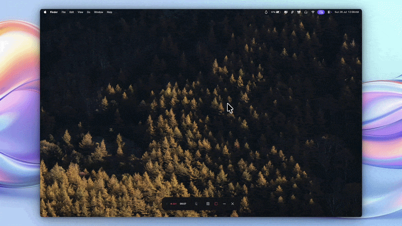

  

<h1>Lantern</h1>
</img>
</img>

   

Lantern is a lightweight, menu-bar-only GUI wrapper for Cloudflare's `warp-cli` on macOS.

It was built out of frustration with Cloudflare's enshittified, bloated and intrusive macOS client update, which replaced the original, clean menu-bar toggle with an unwanted standalone window app. Lantern brings back the minimal, native-feeling menu-bar experience with simple, single-click controls.

---

## Why Lantern?

* **No Bloat:** It sits exclusively in your menu bar. No windows whatsoever.
* **Old-School Simplicity:** Restores the classic WARP menu-bar behavior, which is click to open a clean dropdown to toggle connection, and get out of the way.
* **Lightweight:** Built natively in SwiftUI to keep resource usage minimal.

---

## Features

* **Menu-Bar Only Interface:** Completely headless-style control over your WARP connection.
* **Flexible Modes:** Support for `1.1.1.1` with or without WARP tunnel enabled.
* **Trusted Wi-Fi Networks:** Option to disconnect or bypasses the tunnel when connected to specified Wi-Fi networks.
* **Routing Controls:** Split Tunneling and Local Domain Fallback configuration support.
* **Proxy Mode Support:** WARP's built-in local proxy mode.
* **Launch at Login:** Native support for launch at login (duh)

---

## Prerequisites

Lantern requires `warp-cli` to be present on your system to perform connection commands.

You can satisfy this requirement in two ways:
1. **Official Cloudflare WARP App:** Keep the official app installed. Lantern will talk directly to its underlying `warp-cli` binary. (The official app DOES NOT NEED TO BE RUNNING (yay)).
2. **Standalone `warp-cli`:** Modified from the original app, with the GUI removed. The tutorial for extracting the cli yourself from the official app is here.

---

## Installation

1. Download the latest `.dmg` release from the **Releases** section.
2. Open the `.dmg` and drag `Lantern.app` into your `/Applications` folder.
3. **First Launch (macOS Gatekeeper):** Because this app isn't signed with a $99/year Apple Developer certificate, macOS will block it on first run. To open:
   * Go to **System Settings > Privacy & Security**.
   * Scroll down to the security section and click **Open Anyway** next to the Lantern block notice.

---

## Updates

If you have any feature ideas, please do let me know, and we can work on that swift-ly (pun definitely intended). Plus, if you find any bugs, or memory leaks (I hope not), mention them in the issues panel, and I would love to take a look. Peace!